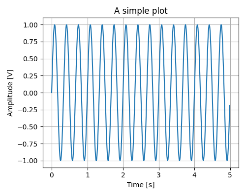

# editplt
Save your Matplotlib plots as JSON to edit later

Ever made your plot saved and then a week later realised the font size has to be increased? Pretty annoying to run the simulations again to generate a new plot.

Well, fret not, use 'editplt' to save your matplotlib plots and edit whenever you want 

### Usage example to store plot data
```python
from editplt import plt2json

t = np.arange(0, 5, 0.01)
fig, axs = plt.subplots()
axs.plot(t, np.sin(2*np.pi*3*t))
axs.set_title('A simple plot')
axs.set_xlabel('Time [s]')
axs.set_ylabel('Amplitude [V]')
axs.grid(True)

plt2json(axs, "example.json", pprint=False)
```
### Usage example to plot from json data
```python
from editplt import json2plt
fig, axs = json2plt("example.json")
plt.show()
```

And you get your plot,



